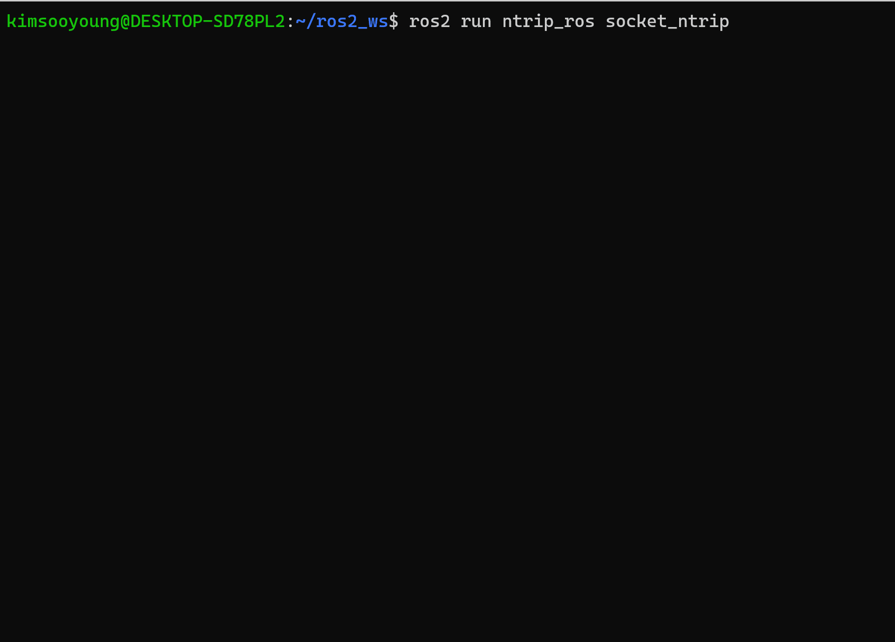

# ntrip_ros2

## Environment

* Ubuntu 20.04 
* ROS 2 Foxy
* Mount located in South Korea

## Build & Run 

* Build

```
# Build Custom message for rtcm
colcon build --packages-select rtcm_msgs
# Build core pkg
colcon build --packages-select ntrip_ros

# Don't forget to setup.bash
source ./install/setup.bash
```

* Run

```
ros2 run ntrip_ros socket_ntrip
ros2 launch ntrip_ros ntrip_client.launch.py
```

# Demo

<p align="center">
    
</p>

1. First Request with several Data for RTCM Server Connection
2. After Valid Request, It starts to recieve RTCM packets from server
3. Too long msg length will be blocked for preformance.
4. This ROS node will continuously retry even timeout Error occured. 

You can generate the require $GPGGA message at this site. https://www.nmeagen.org/ Set a point near where you want to run and click "Generate NMEA file". Cut and paste the $GPGGA message into the launch file.